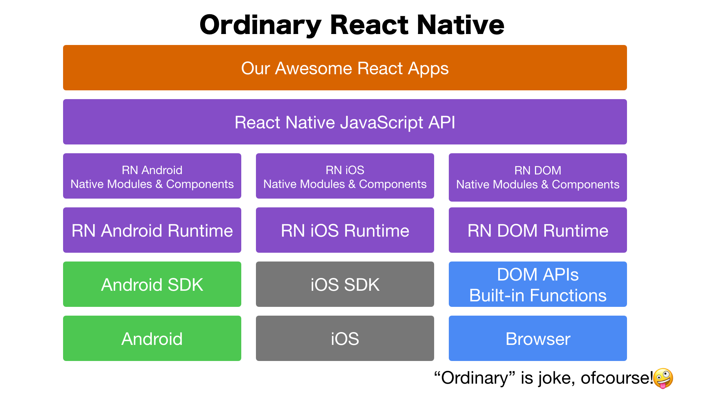

Vue Native DOM
==========

Vue Native & React Native DOM Sample.

* Vue Native https://vue-native.io/
* React Native DOM https://github.com/vincentriemer/react-native-dom

How works
----------

Ordinarily, React Native works as below.

And this sample works as below!

Vue Native translates Vue into React, so React Native recognizes application codes as React.