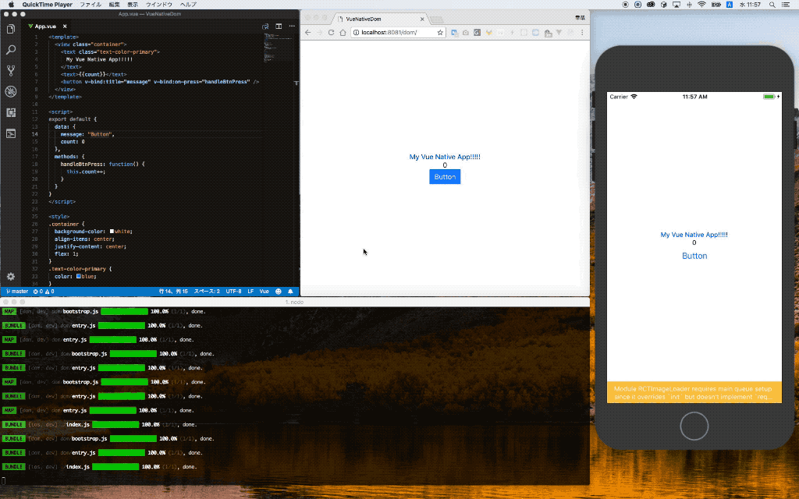

Vue Native DOM
==========

Vue Native & React Native DOM Sample.

* Vue Native https://vue-native.io/
* React Native DOM https://github.com/vincentriemer/react-native-dom

How works
----------

Ordinarily, React Native works as below.


And this sample works as below!


Vue Native translates Vue into React, so React Native recognizes application codes as React.

Getting Started
----------

### Install

```
$ yarn install
```

### Start Dev Server

```
$ yarn start
```

### Run on Browser

Nothing to do on terminal!

Access http://localhost:8081 !

### Run on Device / Emulator

```
$ react-native run-ios
or
$ react-native run-android
```

Demo
----------

